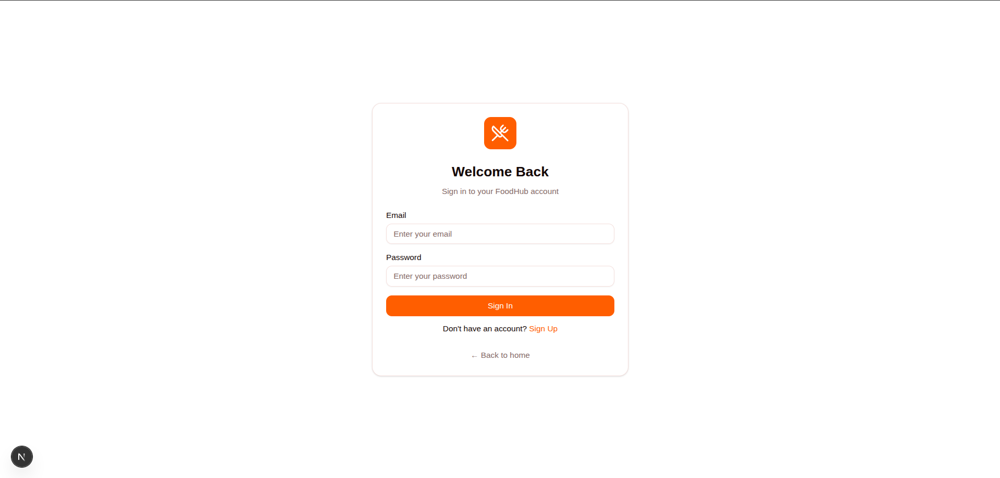
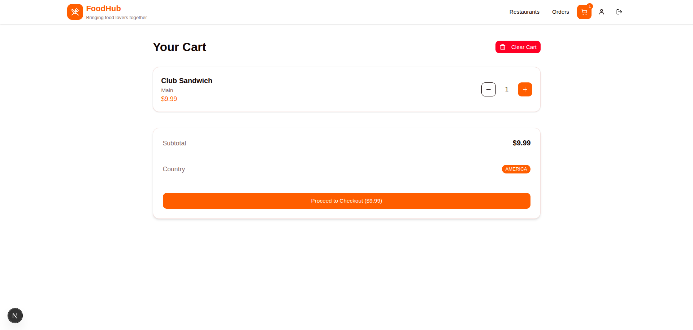

# 🍔 Slooze Full Stack Assessment

## 📌 Overview

This is a full-stack **Food Ordering Web Application** built as part of the **Slooze Take-Home Assignment**.  
It allows users (**Admin**, **Managers**, and **Team Members**) to browse restaurants and menus, create and manage orders, and handle payments — all with **Role-Based Access Control (RBAC)** and **country-based data segregation**.

---

## 🧩 Problem Statement

Nick Fury is a business owner with 5 employees:

| Name            | Role     | Country  |
|-----------------|----------|----------|
| Nick Fury       | Admin    | Global   |
| Captain Marvel  | Manager  | India    |
| Captain America | Manager  | America  |
| Thanos          | Member   | India    |
| Thor            | Member   | India    |
| Travis          | Member   | America  |

Nick wants a web-based food ordering application with the following functionalities:

| Function                      | Admin  | Manager  | Member   |
|-------------------------------|--------|----------|----------|
| View restaurants & menu items | ✅     | ✅       | ✅       |
| Create order (add food items) | ✅     | ✅       | ✅       |
| Place order (checkout & pay)  | ✅     | ✅       | ❌       |
| Cancel order                  | ✅     | ✅       | ❌       |
| Update payment method         | ✅     | ❌       | ❌       |

Additional rules:
- Managers and Members can **only access data from their own country** (India or America).
- Admin has **global access**.

---

## 🏗️ Tech Stack

### 🔹 Backend
- **Node.js / Express**
- **TypeScript**
- **MongoDB / Mongoose**
- **JWT Authentication**
- **RBAC Middleware**

### 🔹 Frontend
- **Next.js 16**
- **React 19**
- **Tailwind CSS**
- **Axios for API integration**
- **ShadCN UI**

---

## ⚙️ Features

✅ **Authentication & RBAC**  
- JWT-based login with role validation middleware  
- Role-based and country-based authorization  

✅ **Restaurants & Menu**  
- View restaurants and their menu items  
- Filter access by country  

✅ **Orders & Cart**  
- Create and manage orders  
- Add food items to cart  
- Checkout and payment simulation (Admin/Manager only)  
- Cancel orders (Admin/Manager only)  

✅ **Payment Management**  
- Admin can add or update payment methods  

✅ **Data Isolation**  
- Managers and Members can only access data from their assigned country  

---

## 🧠 Architecture Overview

**Flow:**

```

Frontend (Next.js)
↓
API Gateway (Express + JWT)
↓
RBAC Middleware (role + country check)
↓
MongoDB (Users, Restaurants, Orders, Cart, Payment)

````

---

## 🔑 Roles and Access Control

| Route                  | Admin  | Manager  | Member   | Description            |
|------------------------|--------|----------|----------|------------------------|
| GET /restaurants       | ✅     | ✅       | ✅       | View all restaurants   |
| GET /menu/:id          | ✅     | ✅       | ✅       | View menu items        |
| POST /cart/add         | ✅     | ✅       | ✅       | Add food items to cart |
| POST /order/checkout   | ✅     | ✅       | ❌       | Checkout and pay       |
| POST /order/cancel/:id | ✅     | ✅       | ❌       | Cancel an order        |
| PATCH /payment-method  | ✅     | ❌       | ❌       | Update payment method  |

---

## 🧑‍💻 Installation & Setup

### 1️⃣ Clone the Repository
```bash
git clone https://github.com/rupesh-dev30/Slooze-Full-Stack-Assessment.git
cd Slooze-Full-Stack-Assessment
````

---

### 2️⃣ Setup Backend

```bash
cd backend
npm install
```

Create a `.env` file inside `backend/`:

```bash
PORT=9001
MONGO_URI=<YOUR_MONGO_DB_URL>
JWT_SECRET=<YOUR_JWT_SECRET>
COOKIE_NAME=token
NODE_ENV=development
```

Run the seed file to insert initial users and data:

```bash
# If tsx is not installed globally
npm install -g tsx

# Then run seed
tsx src/database/seed.ts
```

Start the server:

```bash
npm run dev
```

---

### 3️⃣ Setup Frontend

```bash
cd ../frontend
npm install
npm run dev
```

Open 👉 **[http://localhost:3000](http://localhost:3000)**

---

## 🍱 Example Users

| Name            | Email                | Password      | Role    | Country |
| --------------- | -------------------- | ------------- | ------- | ------- |
| Nick Fury       | `nick@avengers.com`  | `password123` | Admin   | America |
| Captain Marvel  | `cm@company.com`     | `password123` | Manager | India   |
| Captain America | `ca@company.com`     | `password123` | Manager | America |
| Thanos          | `thanos@company.com` | `password123` | Member  | India   |
| Thor            | `thor@company.com`   | `password123` | Member  | India   |
| Travis          | `travis@company.com` | `password123` | Member  | America |

---

## 🧩 API and Middleware Summary

### Auth Routes

* `POST /api/auth/register` → Register a new user
* `POST /api/auth/login` → Login and get JWT token in cookies
* `POST /api/auth/logout` → Logout user
* `GET /api/auth/me` → Get current logged-in user info

### Restaurant Routes

* `GET /api/restaurants` → Get all restaurants
* `GET /api/restaurants/:id/menu` → Get menu items

### Cart Routes

* `GET /api/cart` → Get user cart
* `POST /api/cart` → Add item
* `PUT /api/cart` → Update quantity
* `DELETE /api/cart/:menuItemId` → Remove item
* `DELETE /api/cart` → Clear entire cart

### Order Routes

* `POST /api/orders` → Create new order
* `GET /api/orders` → List orders (filtered by role/country)
* `POST /api/orders/:id/checkout` → Checkout & pay
* `POST /api/orders/:id/cancel` → Cancel order
* `GET /api/orders/:id` → Get single order details

### Payment Routes

* `GET /api/payments` → List payment methods
* `POST /api/payments` → Create payment method
* `PUT /api/payments/:id` → Update payment method (Admin only)

---

### 🔒 Middlewares

**authMiddleware:**

* Checks JWT token in cookies
* Verifies user and attaches to `req.user`
* Returns 401 if unauthorized

**permit(...roles):**

* Restricts access to certain roles
* Example: `permit("ADMIN", "MANAGER")`

**restrictByCountry(getResourceCountry):**

* Blocks users from accessing another country’s data
* Admin bypasses this check

---

## 🗄️ Seeded Data

Your seed script automatically creates:

* 6 users (Admin, Managers, Members)
* Sample restaurants for **India** and **America**
* Menu items for each restaurant

---

## 🖼️ Screenshots

| Login                             | Restaurants                                   | Cart                            | Orders                              |
| --------------------------------- | --------------------------------------------- | ------------------------------- | ----------------------------------- |
|  |  |  |  |

---

## 🎯 Bonus Objectives Implemented

* ✅ Role-based Access Control (RBAC)
* ✅ Country-based data filtering
* ✅ JWT Auth with cookie storage
* ✅ Seed script for auto data setup
* ✅ Payment management system

---

## 👨‍💻 Author

**Rupesh Kumar**
🔗 [GitHub](https://github.com/rupesh-dev30)

---

## 📜 License

This project is open-sourced under the **MIT License**.

```
